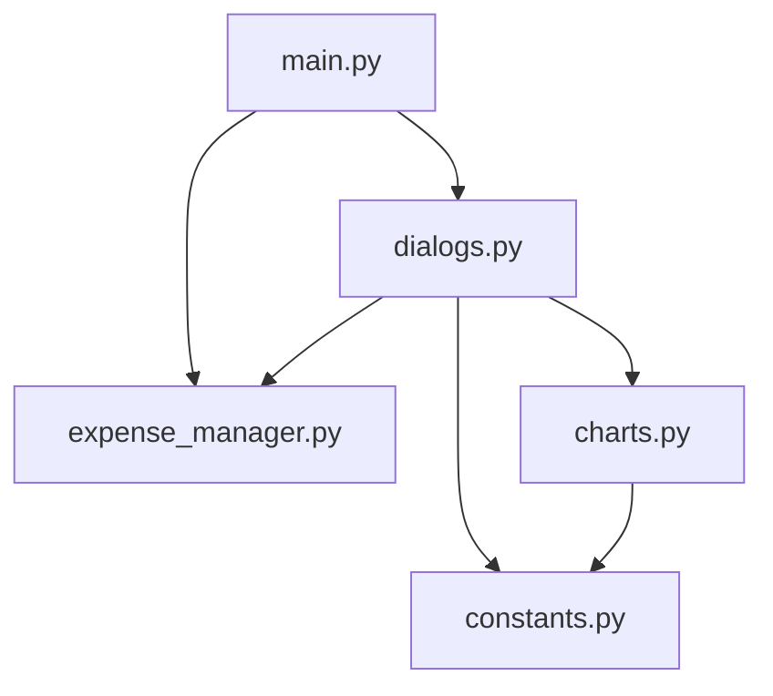

# Implementation Guide

This document describes the internal architecture, design patterns, and code flow of the Expense Monitoring Bot.

## Architecture Overview

The bot is built on top of `my_bot_framework` and follows its patterns for dialogs and messaging. It uses a **keyboard-based interface** with persistent reply keyboards instead of slash commands.

```
┌──────────────────────────────────────────────────────────────────┐
│                         main.py                                  │
│         (Entry point, keyboard handling, event loop)             │
├──────────────────────────────────────────────────────────────────┤
│                                                                  │
│  ┌──────────────┐    ┌───────────────┐    ┌──────────────────┐   │
│  │   dialogs.py │    │expense_manager│    │    charts.py     │   │
│  │   (Flows)    │    │   (CRUD)      │    │ (Visualization)  │   │
│  └──────┬───────┘    └──────┬────────┘    └────────┬─────────┘   │
│         │                   │                      │             │
│         └───────────────────┼──────────────────────┘             │
│                             │                                    │
│                             ▼                                    │
│                    ┌────────────────┐                            │
│                    │   constants.py │                            │
│                    │  (Categories)  │                            │
│                    └────────────────┘                            │
│                                                                  │
├──────────────────────────────────────────────────────────────────┤
│                      my_bot_framework                            │
│         (BotApplication, Dialogs, ReplyKeyboards, Messages)     │
└──────────────────────────────────────────────────────────────────┘
```

## Module Structure

```
expense_bot/
├── __init__.py           # Package init
├── main.py               # Bot entry point and keyboard event handling
├── expense_manager.py    # CSV CRUD operations (Expense dataclass, ExpenseManager)
├── dialogs.py            # Interactive dialog flows and keyboard helpers
├── charts.py             # Pie chart generation with matplotlib
└── constants.py          # Category definitions and help text
```

### Module Dependency Graph



### Dependency Table

| Module | Imports From |
|--------|--------------|
| `constants.py` | *(no internal dependencies)* |
| `expense_manager.py` | *(no internal dependencies)* |
| `charts.py` | `constants` |
| `dialogs.py` | `constants`, `expense_manager`, `charts` (lazy) |
| `main.py` | `dialogs`, `expense_manager` |

## Core Components

### 1. ExpenseManager (expense_manager.py)

The `ExpenseManager` class handles all CRUD operations for expenses stored in CSV files.

**Expense Dataclass:**

```python
@dataclass
class Expense:
    id: int           # Unique within month
    timestamp: datetime
    category: str     # Category key (home, transport, etc.)
    description: str
    price: float
    year: int         # Source file year
    month: int        # Source file month
```

**Key Methods:**

| Method | Description |
|--------|-------------|
| `get_expenses(year, month)` | Get all expenses for a month, sorted by timestamp |
| `get_recent(count)` | Get N most recent expenses across all months |
| `add_expense(...)` | Add new expense, auto-assigns ID |
| `remove_expense(id, year, month)` | Remove expense by ID |
| `modify_expense(id, year, month, ...)` | Update expense, preserves ID and timestamp |
| `get_expenses_by_category(year, month)` | Get totals grouped by category |
| `get_month_total(year, month)` | Get total expenses for a month |

**File Organization:**

```
data/
├── 2025/
│   ├── 10.csv
│   ├── 11.csv
│   └── 12.csv
└── 2026/
    ├── 01.csv
    └── 02.csv
```

Each CSV has columns: `id`, `timestamp`, `category`, `description`, `price`

**Note:** Categories are stored with capital first letter (e.g., "Home", "Transport") via `Expense.to_row()` which calls `category.capitalize()`.

### 2. Dialog Flows (dialogs.py)

All interactive features use dialog flows built with the framework's dialog system. Dialogs are triggered by keyboard button presses rather than slash commands.

**Global ExpenseManager Pattern:**

```python
_expense_manager: Optional[ExpenseManager] = None

def set_expense_manager(manager: ExpenseManager) -> None:
    global _expense_manager
    _expense_manager = manager

def get_expense_manager() -> ExpenseManager:
    if _expense_manager is None:
        raise RuntimeError("ExpenseManager not set")
    return _expense_manager
```

This pattern allows dialogs to access the manager without passing it through every function.

### 3. Charts (charts.py)

Generates pie charts using matplotlib with:
- Color-coded categories
- Percentage labels (>5%)
- Legend with amounts
- Title with month/year and total
- Generation timestamp footer

**Color Palette:**

| Category | Color |
|----------|-------|
| Home | Red (#FF6B6B) |
| Transportation | Teal (#4ECDC4) |
| Groceries | Blue (#45B7D1) |
| Dining Out | Green (#96CEB4) |
| Other | Yellow (#FFEAA7) |

### 4. Constants (constants.py)

Defines the category system:

```python
CATEGORIES = [
    ("Home", "home"),
    ("Transportation", "transport"),
    ("Groceries", "groceries"),
    ("Dining Out", "dining"),
    ("Other", "other"),
    ("Help", "help"),
]

CATEGORY_NAMES = {
    "home": "Home",
    "transport": "Transportation",
    ...
}

VALID_CATEGORIES = {"home", "transport", "groceries", "dining", "other"}
```

## Dialog Flow Details

### Add Expense Flow

```
┌─────────────────┐
│ CategoryChoice  │  Custom dialog with Help button support
│ WithHelp        │
└────────┬────────┘
         │
         ▼
┌─────────────────┐
│  UserInputDialog│  "Enter a brief description:"
│  (description)  │
└────────┬────────┘
         │
         ▼
┌─────────────────┐
│  UserInputDialog│  "Enter the price:" (validate_positive_float)
│     (price)     │
└────────┬────────┘
         │
         ▼
┌─────────────────┐
│  DialogHandler  │  _on_add_complete callback
│   (save)        │  → expense_manager.add_expense()
└─────────────────┘
```

**CategoryChoiceWithHelp:**

A custom `Dialog` subclass that wraps `ReplyKeyboardChoiceDialog` and handles the "Help" button by showing category descriptions and re-displaying the choice buttons:

```python
class CategoryChoiceWithHelp(Dialog):
    async def _run_dialog(self) -> DialogResult:
        while True:
            result = await ReplyKeyboardChoiceDialog(...).start(self.context)
            if result == "help":
                await get_app().send_messages(CATEGORY_HELP)
                continue  # Show choices again
            return result
```

### Remove Expense Flow

```
┌──────────────────┐
│ReplyKeyboardChoice│  "Current Month" or "Different Month"
│  BranchDialog    │
└────────┬─────────┘
         │
    ┌────┴────┐
    │         │
    ▼         ▼
Current    UserInput
Month      (MM/YYYY)
    │         │
    └────┬────┘
         │
         ▼
┌─────────────────┐
│ReplyKeyboard    │◄─────────┐ 5 expenses per page, newest first
│PaginatedChoice  │          │ [Category] Description - ₪X.XX (DD/MM)
│Dialog           │          │
└────────┬────────┘          │
         │                   │
         ▼                   │
┌─────────────────┐          │
│ReplyKeyboard    │          │  
│ConfirmDialog    │          │
│ "Remove this    │          │
│      expense?"  │          │
└────────┬────────┘          │
         │                   │
    ┌────┴────┐              │
    │         │              │
    ▼         ▼              │
  Yes        No ─────────────┘
    │              (loops back to select different expense)
    ▼
┌─────────────────┐
│  DialogHandler  │
│   (remove)      │
│                 │
│  → expense_     │
│    manager.     │
│    remove_      │
│    expense()    │
└─────────────────┘
```

**Confirmation Dialog Behavior:**

- **"Yes"**: Proceeds with removal → `_on_remove_complete` callback
- **"No"**: Loops back to expense selection (allows selecting a different expense)
- **"Cancel"**: Exits the flow entirely

**Expense Callback Data Format:**

Expenses are identified by callback data in format: `year:month:id`

```python
def _parse_expense_callback(callback: str) -> tuple[int, int, int]:
    parts = callback.split(":")
    return int(parts[0]), int(parts[1]), int(parts[2])
```

### Modify Expense Flow

```
┌─────────────────┐◄────────────────────────────────────────────┐
│ Month Selection │  Same as Remove flow                        │
└────────┬────────┘                                             │
         │                                                      │
         ▼                                                      │
┌─────────────────┐                                             │
│ Expense Select  │  ReplyKeyboardPaginatedChoiceDialog         │
└────────┬────────┘                                             │
         │                                                      │
         ▼                                                      │
┌─────────────────┐                                             │
│ Show Current    │  Display current category, description,     │
│    Values       │  price                                      │
└────────┬────────┘                                             │
         │                                                      │
         ▼                                                      │
┌─────────────────┐                                             │
│ Category Choice │  "Keep Current" or select new category      │
│  (with Help)    │  Shows current category as default          │
└────────┬────────┘                                             │
         │                                                      │
         ▼                                                      │
┌─────────────────┐                                             │
│ Description     │  "Keep Current" or "Enter New"              │
│     Choice      │                                             │
└────────┬────────┘                                             │
         │                                                      │
    ┌────┴────┐                                                 │
    │         │                                                 │
    ▼         ▼                                                 │
Keep      UserInput                                             │
Current   (new desc)                                            │
    │         │                                                 │
    └────┬────┘                                                 │
         │                                                      │
         ▼                                                      │
┌─────────────────┐                                             │
│   Price Choice  │  "Keep Current" or "Enter New"              │
└────────┬────────┘                                             │
         │                                                      │
    ┌────┴────┐                                                 │
    │         │                                                 │
    ▼         ▼                                                 │
Keep      UserInput                                             │
Current   (validated)                                           │
    │         │                                                 │
    └────┬────┘                                                 │
         │                                                      │
         ▼                                                      │
┌─────────────────┐                                             │
│ Check Changes   │  If no changes → "No changes made" → exit   │
└────────┬────────┘                                             │
         │                                                      │
         ▼                                                      │
┌─────────────────┐                                             │
│ Confirmation    │  Shows old→new for each changed field       │
│   Dialog        │  "Confirm changes?\n\nCategory: X → Y\n…"   │
└────────┬────────┘                                             │
         │                                                      │
    ┌────┴────┐                                                 │
    │         │                                                 │
    ▼         ▼                                                 │
  Yes        No ────────────────────────────────────────────────┘
    │              (loops back to start)
    ▼
┌─────────────────┐
│  DialogHandler  │
│   (modify)      │
│                 │
│  → expense_     │
│    manager.     │
│    modify_      │
│    expense()    │
└─────────────────┘
```

**Flow Details:**

1. **Month Selection**: Same as remove flow (current month or custom MM/YYYY)
2. **Expense Selection**: Paginated list showing expenses
3. **Current Values Display**: Shows all current values before modification
4. **Field-by-Field Modification**:
   - **Category**: "Keep Current" option + category selection (with Help support)
   - **Description**: "Keep Current" or "Enter New" (if new, prompts for input)
   - **Price**: "Keep Current" or "Enter New" (if new, validates positive float)
5. **Change Detection**: After collecting all values, checks if any changes were made
6. **Confirmation**: Shows old→new comparison only for changed fields
7. **Confirmation Actions**:
   - **"Yes"**: Proceeds with modification → `_on_modify_complete` callback
   - **"No"**: Returns to start of dialog (allows selecting different expense)
   - **"Cancel"**: Exits the flow entirely

**Preservation of ID and Timestamp:**

When modifying, the original `id` and `timestamp` are preserved to maintain order and creation time. Only `category`, `description`, and `price` are updated. Users can keep current values for any field by selecting "Keep Current".

### Export Flow

```
┌──────────────────┐
│ReplyKeyboardChoice│  "Previous Month" or "Provide Month"
│  BranchDialog    │
└────────┬─────────┘
         │
    ┌────┴────┐
    │         │
    ▼         ▼
Previous   UserInput
Month      (MM/YYYY)
    │         │
    └────┬────┘
         │
         ▼
┌─────────────────┐
│  DialogHandler  │  _on_export_complete callback
│   (export)      │  → TelegramDocumentMessage(csv_path)
└─────────────────┘
```

### Chart Flow

```
┌──────────────────┐
│ReplyKeyboardChoice│  "Previous Month" or "Provide Month"
│  BranchDialog    │
└────────┬─────────┘
         │
    ┌────┴────┐
    │         │
    ▼         ▼
Previous   UserInput
Month      (MM/YYYY)
    │         │
    └────┬────┘
         │
         ▼
┌─────────────────┐
│  DialogHandler  │  _on_chart_complete callback
│   (chart)       │  → generate_expense_chart()
│                 │  → TelegramImageMessage(chart_path)
└─────────────────┘
```

**Flow Details:**

1. **Month Selection**: User selects "Previous Month" or "Provide Month" (enters MM/YYYY)
2. **Immediate Generation**: Chart is generated and sent immediately after month selection (no confirmation step)
3. **Completion**: `_on_chart_complete` callback is called (chart already sent, nothing more to do)

## Keyboard-Based Interface

The bot uses **persistent reply keyboards** instead of slash commands. All interactions are handled through button presses.

### Main Keyboard

The main keyboard has two buttons:
- **Add** - Starts the add expense dialog
- **More** - Shows the secondary options menu

### More Menu Keyboard

The More menu keyboard has:
- **Remove** - Starts remove expense dialog
- **Modify** - Starts modify expense dialog
- **Recent** - Shows recent expenses (no dialog)
- **Export** - Starts export CSV dialog
- **Chart** - Starts chart generation dialog
- **Info** - Shows help information
- **Back** - Returns to main keyboard

### Keyboard Handling

Keyboard buttons are handled in `main.py` via `handle_text_update()`:

```python
# Main menu buttons
if text == "Add":
    await handle_add()  # Starts add expense dialog
if text == "More":
    await send_more_keyboard()  # Shows More menu

# More menu buttons
if text == "Remove":
    await handle_remove()  # Starts remove expense dialog
# ... etc
```

### Remaining Commands

Only two commands remain:
- `/commands` - Lists available commands (built-in)
- `/terminate` - Stops the bot gracefully (built-in)

These are handled separately in `handle_text_update()` before keyboard button routing.

## Data Flow

### Adding an Expense

```
1. User: Presses "Add" button
2. Bot: Category selection keyboard (inline buttons)
3. User: Selects "Groceries"
4. Bot: "Enter a brief description:"
5. User: "Weekly shopping"
6. Bot: "Enter the price:"
7. User: "85.50"
8. Bot: _on_add_complete() called
   └─► expense_manager.add_expense(
         category="groceries",
         description="Weekly shopping",
         price=85.50
       )
   └─► Appends row to data/2026/02.csv (category saved as "Groceries")
   └─► Sends confirmation message
   └─► Main keyboard is restored
```

### CSV File Format

```csv
id,timestamp,category,description,price
1,2026-02-01 10:30:00,Groceries,Weekly shopping,85.50
2,2026-02-01 14:15:00,Dining,Lunch with colleagues,32.00
3,2026-02-02 09:00:00,Transport,Gas,45.00
```

**Note:** Categories are capitalized (first letter uppercase) when written to CSV via `Expense.to_row()`.

### ID Generation

IDs are auto-incremented per month:

```python
def _get_next_id(self, year: int, month: int) -> int:
    expenses = self.get_expenses(year, month)
    if not expenses:
        return 1
    return max(e.id for e in expenses) + 1
```

## Error Handling

### Validation

- **Prices**: Validated with `validate_positive_float` (rejects non-numeric, negative, zero)
- **Dates**: Validated with `validate_date_format("%m/%Y", "MM/YYYY")`
- **Categories**: Checked against `VALID_CATEGORIES` set

### Dialog Cancellation

All dialogs support cancellation via the Cancel button (inline button in dialogs):

```python
if is_cancelled(result):
    await get_app().send_messages("Operation cancelled.")
    return
```

### No Data Scenarios

- **No expenses for month**: Shows "No expenses found" message
- **Empty CSV file**: Returns empty list from `get_expenses()`
- **No CSV file**: Returns empty list (file created on first write)

## Startup Flow

```
1. Configure logging to expense_bot.log (append mode, INFO level)
2. Read credentials from .token and .chat_id files
3. Initialize ExpenseManager with data/ directory
4. Call set_expense_manager() to make it globally available
5. Initialize BotApplication with credentials
6. Send startup message with main keyboard
7. Start keyboard event loop (polling for updates)
```

**Logging Configuration:**

Logging is configured in `main()` using `logging.basicConfig()`:
- **Output**: `expense_bot.log` in project root (not console)
- **Mode**: Append (`filemode="a"`) - preserves previous logs
- **Level**: INFO
- **Format**: `%(asctime)s %(levelname)s %(name)s: %(message)s`

The keyboard event loop (`run_keyboard_event()`) handles:
- Text messages (keyboard button presses, commands)
- Callback queries (stale inline buttons from dialogs)
- Routes to appropriate handlers based on button text

## Framework Integration

### Used Framework Components

| Component | Usage |
|-----------|-------|
| `BotApplication` | Singleton for bot lifecycle |
| `TelegramReplyKeyboardMessage` | Persistent keyboard buttons (main menu, More menu) |
| `ReplyKeyboardChoiceDialog` | Category selection (reply keyboard buttons) |
| `ReplyKeyboardChoiceBranchDialog` | Month selection (current vs custom) |
| `ReplyKeyboardPaginatedChoiceDialog` | Expense selection (5 per page) |
| `UserInputDialog` | Text/number input with validation |
| `ReplyKeyboardConfirmDialog` | Confirmation prompts |
| `SequenceDialog` | Chaining dialogs (add flow) |
| `DialogHandler` | Callback on completion |
| `Dialog` | Base class for custom dialogs (CategoryChoiceWithHelp, RemoveExpenseDialog, etc.) |
| `TelegramDocumentMessage` | CSV export |
| `TelegramImageMessage` | Chart sending |
| `TelegramCallbackAnswerMessage` | Handle stale callback queries |
| `TelegramRemoveKeyboardMessage` | Remove stale keyboards |
| `validate_positive_float` | Price validation |
| `validate_date_format` | Date format validation |
| `format_numbered_list` | Recent expenses formatting |
| `is_cancelled` / `CANCELLED` | Cancellation detection |
| `poll_updates` | Poll for Telegram updates |
| `get_stop_event` | Event for graceful shutdown |

### Custom Dialog: CategoryChoiceWithHelp

The only custom dialog extends the framework's `Dialog` to add Help button support:

```python
class CategoryChoiceWithHelp(Dialog):
    """Custom dialog for category selection with Help button support."""
    
    def __init__(self) -> None:
        super().__init__()
        self._choice_dialog: Optional[ReplyKeyboardChoiceDialog] = None

    async def _run_dialog(self) -> DialogResult:
        while True:
            self._choice_dialog = ReplyKeyboardChoiceDialog(
                prompt="Select expense category:",
                choices=CATEGORIES,
                include_cancel=True,
            )
            result = await self._choice_dialog.start(self.context)

            if is_cancelled(result):
                return result

            if result == "help":
                await get_app().send_messages(CATEGORY_HELP)
                continue

            if result in VALID_CATEGORIES:
                return result
```

## Extension Points

### Adding a New Category

1. Update `CATEGORIES` in `constants.py`:
   ```python
   CATEGORIES.insert(-1, ("Health", "health"))  # Before Help
   ```

2. Update `CATEGORY_NAMES`:
   ```python
   CATEGORY_NAMES["health"] = "Health"
   ```

3. Update `VALID_CATEGORIES`:
   ```python
   VALID_CATEGORIES.add("health")
   ```

4. Update `CATEGORY_HELP` with description

5. Add color to `CATEGORY_COLORS` in `charts.py`:
   ```python
   CATEGORY_COLORS["health"] = "#E066FF"
   ```

### Adding a New Keyboard Button

1. Create dialog factory function in `dialogs.py` (if needed)
2. Create completion callback `_on_X_complete` (if dialog-based)
3. Add handler function in `main.py`:
   ```python
   async def handle_new_feature() -> None:
       """Handle the New Feature button press."""
       dialog = create_new_dialog()
       await dialog.start({})
       await send_main_keyboard()
   ```
4. Add button text handling in `handle_text_update()`:
   ```python
   if text == "New Feature":
       logger.info("Handling New Feature button")
       set_next_update_id(update.update_id + 1)
       await handle_new_feature()
       return False
   ```
5. Add button to keyboard in `dialogs.py`:
   ```python
   # In get_main_keyboard_message() or get_more_keyboard_message()
   keyboard=[["Add", "More", "New Feature"]]
   ```

### Adding a Report Type

1. Add method to `ExpenseManager` for data aggregation
2. Create formatting function in `dialogs.py`
3. Add keyboard button handler in `main.py` (similar to `handle_recent()`)
4. Add button to keyboard layout in `dialogs.py`
